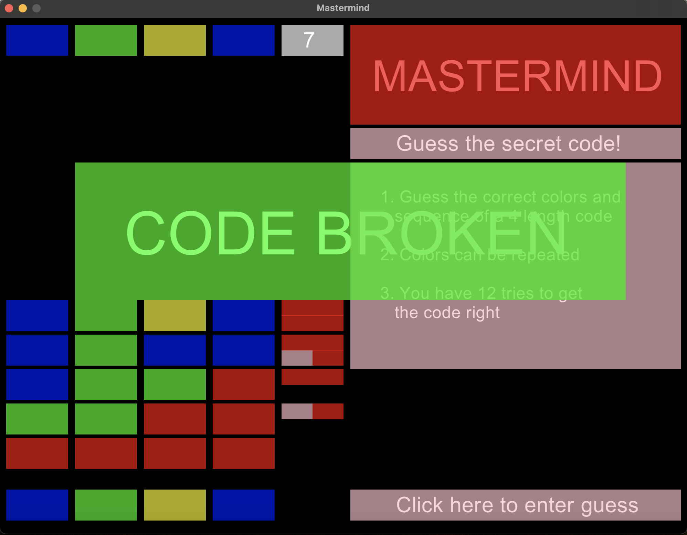

# Mastermind



### Introduction

Hello my name is AJ and this is my implementation of the board game Mastermind!. In this game the Code-breaker (player) must correctly guess the correct four color sequence provided by the Code-maker (cpu/rng). To get started, clone/fork this repo and move on to the
dependencies section.

### Dependencies

This game requires installing ruby along with the ruby gem library gosu as a dependency. This is my first project and I hopefully set up the gemfile correctly so that you simply need to run `bundle install` on your command line. If not, check out this [link](https://www.libgosu.org/ruby.html) on how to install gosu.

If everything is installed correctly, simply run the following code in your terminal to start playing:

```
ruby master_mind.rb 
```

### How to play

The objective of the game is to find the correct 4 color sequence based on feedback of your guesses. Beginning each game, on the bottom left, there are four tiles that change color once you click on them. These tiles start white (there is no white color in the solution). With each click the tiles cycle through the 6 possible colors that the solution may or may not contain:

 * Red
 * Green
 * Blue
 * Yellow
 * Fuchsia
 * Cyan

Keep in mind that colors can be repeated more than once in the solution.
Once you have a 4 color sequence prepared, enter your guess using the button on the bottom right to record it and get feedback on it.

The meaning of feedback tiles next to your recorded guess is as follows:

 * Red tile: Color and position of the tile is correct
 * Pink tile: Color of the tile is correct, but out of position
 * Black tile: Both color and position of the tile is incorrect

You have 12 tries to guess the correct color sequence.


 